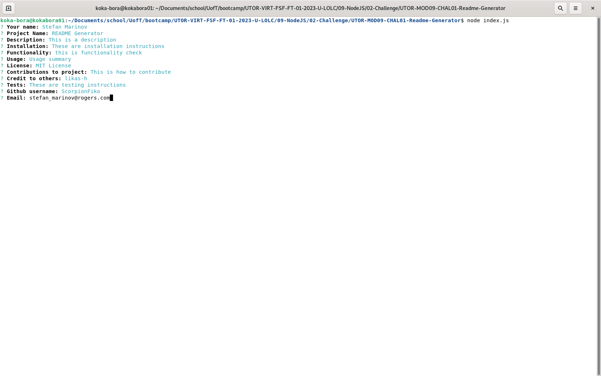
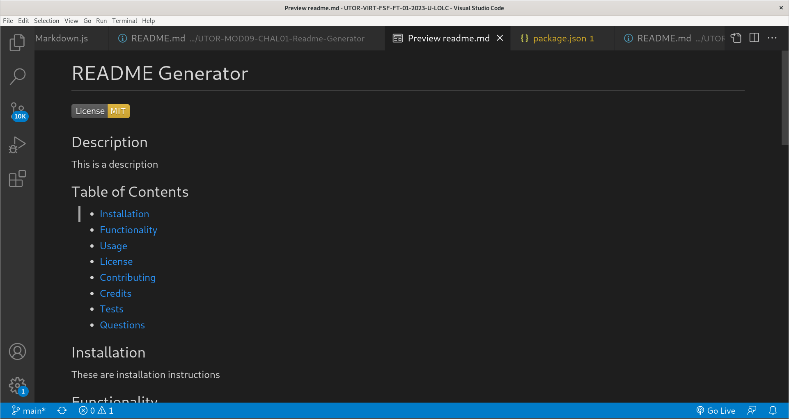

# UTOR-MOD09-CHAL01-Readme-Generator
Univesrity of Toronto - Module 09 - Challenge 01 - README Generator

## Description

Repository containing the code for the README Generator. This is a server side project using node.js where the user is asked a few questions. Once the user answers those questions, the program generates a README file using the information provided. The README file is broken down into the following sections:
- Title
- Description 
- Table of Contents
- Installation 
- Usage
- License
- Contributions (to the project)
- Credit (to others)
- Tests
- Questions (contact)

The user can provide as little or as much information as they desire for each section. Leaving a section blank (i.e. not entering data for a question) will leave that section out of the README file.

Below is the image of the application when the user enters input

Below is the image of the generated readme

## Table of Contents

- [Installation](#installation)
- [Functionality](#functionality)
- [Usage](#usage)
- [Credits](#credits)
- [License](#license)

## Installation

PRE-Requisite: you must have node.js version 16.* installed on your machine prior to proceeding

To run the program in your command line:
1. Download the source code
2. Navigate to the folder containing the package.json file
3. Run npm install

        $ npm install

## Functionality

The following discusses at a high level about some of the features of the website. Detailed code implementation can be found as comments in the JS files.

### Node.js:

The entire porject is built on Node.js utilizing two of additional libraries:
- inquirer: to manage user input  
- fs: to manage the file operations

The application writes to the following directories:

        /application_folder/samples/readme/readme.md
        /application_folder/samples/json/readme.json

The application reads license boilerplate language from the files stored in 

        /application_folder/utils/licenseBoilerplate/

### Command Line:

This is a command line application where user input can be questionable. As such there are a few items to be aware of:
- The application does not check for whether the user input is pertaining to the section as opposed to random keystrokes. This is especially important for things like the Github username and email address: those are not verified for correctness.
- Pressing the Enter (or Return) key does not cause a new line, but end of input. So there are cases where the use input is truncated. The new line to be used on the command line is < br >. The application then splits the string and inserts new line characters when necessary.
- The formatting differs between a readme generated from the application and an actual readme generated from VS code (e.g. bullet point vs dashes).

### License Files:

The license options are taken from the options presented at Github when creating a new repository. The boilerplate text is stored in separate files under the 

        ./utils/licenseBoilerplate  
        
The boilerplate text is taken from the various organizations if they provide it; otherwise, only one or two paragraphs are taken. It is important to note that the focus of this application is the functionality behind it and not the full text of the licence file.

As the user selects the license option, the information from the file is pulled and added to the license section. That way the code is free from bulky text and any updates to the license text happen without "code change."

## Usage

For accessing the application: 

- using your command prompt navigate to the application
- type in 

        $ node index.js

- provide information to the various prompts
- go to application_folder/samples/readme to view the readme file
- (optional) go to application_folder/samples/json to view the readme answers provided by the user

## Credits

Lukas-h for the repo on markdown licence badges found here: https://gist.github.com/lukas-h/2a5d00690736b4c3a7ba

## License

Please refer to the LICENSE in the repo.

